# GCS-STATION

Trạm mặt đất chạy trên trình duyệt.

- `gcs_drone_simulator.html` — flight simulator (Three.js) để test tay cầm; kết nối tay cầm qua Web Serial (Chrome/Edge), gửi `$SIMTEL`. Mở trực tiếp file bằng Chrome/Edge.
- `dashboard/` — CSS/JS của dashboard (PID, horizon, charts, controls). Chưa được `index.html` (nằm ở repo QUAD-UAV) tham chiếu.
